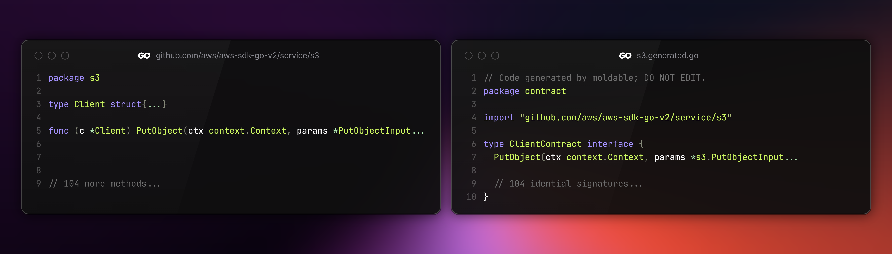

# moldable 🔧


[](https://goreportcard.com/report/github.com/nuvrel/moldable)

`moldable` builds precise interfaces from any package so you can plug in `mockery`, `gomock`, `moq`, or any other mock tool you like.

|  |
| :--: |
| *Example: every exported AWS S3 struct becomes its own ready-to-use interface.* |

> [!WARNING]
> This project is in active development and may contain bugs or breaking changes. We recommend testing thoroughly in your environment before using in production. Issues and contributions are welcome!

## Why?

Most mock generators need an interface to do anything. When a library only exposes concrete structs you must hand-write that interface and keep it in sync with every upstream change. `moldable` creates it in one command and gets out of your way. After that you can use whatever mocking framework you like.

## Features

- Processes entire packages in one command. No need to list every struct; `moldable` automatically finds every exported struct that has methods and builds the matching interface.
- Keeps every setting in a single YAML file so you can generate many packages at once, choose where files land, decide how interfaces are named, and commit that file to version control for identical results on any machine.
- Uses Go's official `go/ast` and `go/types` packages, so the generated file is always syntactically correct.
- Renders every method signature exactly as found in the source (parameter names, types, results, variadic dots).
- Supports generics: type parameters on structs and methods are reproduced with their constraints.
- Preserves type aliases, pointers, slices, maps, channels, embedded structs and any nested combination of them.
- Builds the correct import block automatically, choosing non-conflicting local aliases when the same base name appears from different packages.
- Relies on Go's native package loader, so it honours `go.mod` boundaries, works with vendored code, Go workspaces, and private modules without extra flags.
- Lets you tailor the printed code: pick the package name that appears in generated files, use template names like `{package}.generated.go`, add a suffix (`Client` → `ClientContract`), and place everything in a clean output directory tree.

## Installation

Pick the flow that best fits your environment.

### Download a release (fastest, always works)

> [!NOTE]
> **Why a binary?**
>
> `moldable` is built with the newest Go release so it can parse the newest language features. If the Go installation on your machine is older than the version declared in [`go.mod`](go.mod), `go install` will refuse to build it.
>
> Pre-built binaries bypass that check and run on any OS/arch we ship.

1. Grab the latest binary from the [releases page](https://github.com/nuvrel/moldable/releases).
2. Extract and move the executable to any directory in your `$PATH`.

### Using `go install`

> [!WARNING]
> Requires a Go installation **at least as new as the version declared in [go.mod](go.mod)**.

Install the latest tag:

```bash
go install github.com/nuvrel/moldable/cmd/moldable@latest
```

Pin to a specific version (**recommended**):

```bash
go install github.com/nuvrel/moldable/cmd/moldable@v1.0.0
```

Check the result:

```bash
moldable version
```

## Getting Started

1. Create a starter config

    ```bash
    moldable init
    ```

2. Edit `moldable.yaml`

    Replace the example path with the package you want.

    For instance, to generate interfaces for the AWS S3 service package:

    ```yaml
    packages:
      - path: github.com/aws/aws-sdk-go-v2/service/s3
    ```

    Add more packages underneath if you need them.

> [!WARNING]
> The listed package must already be present in your module (i.e. `go get` it first).

3. Generate interfaces

    ```bash
    moldable
    ```

4. Use the generated files with any mock tool you like:

    - [mockery](https://github.com/vektra/mockery)
    - [gomock](https://github.com/uber-go/mock)
    - [moq](https://github.com/matryer/moq)
    - or any other generator that accepts plain Go interfaces

Re-run `moldable` whenever the upstream code changes; imports and file lists are recalculated automatically.

## Configuration

The file `moldable.yaml` is created by `moldable init` command.

Use the template as-is or edit the values you need; then add at least one real package path.

```yaml
---
# Output configuration for generated interface files
output:
  # Directory where generated files will be written
  dir: ./generated

  # Package name for generated code (singular noun following Go conventions)
  package: contract

  # File naming pattern for generated files
  # Uses {package} placeholder for the original package name
  filename: "{package}.generated.go"

  # Naming conventions for generated interfaces
  naming:
    # Suffix for interface names (e.g., "Contract" for "ClientContract")
    suffix: Contract

# Packages to process
packages:
  - path: github.com/example/package/foo

  # Additional packages
  # - path: github.com/example/package/bar

```

Here are the validation rules:

| Field | Requirement |
|-------|-------------|
| `output.dir` | non-empty string |
| `output.package` | valid Go identifier |
| `output.filename` | must contain substring `{package}` |
| `output.naming.suffix` | letters, digits or `_` only |
| `packages[].path` | non-empty import path |
| duplicate package paths | rejected |

After editing, run `moldable` again; imports and method sets are re-computed automatically.

## License

MIT.

See the [LICENSE](LICENSE.md) file for the full text.
